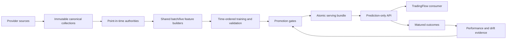

# Catalyst-Confirmation Prediction Architecture

Status: design authority
Last updated: 2026-09-20

This document defines stable component boundaries. Current progress and blockers are
in `active_edge_rebuild_plan.md` and `reviews/active_edge_rebuild_handoff.md`.

## System Boundary

`market-predictor` owns data curation, causal features, labels, model research,
validation, promotion, prediction, and outcome evaluation. It does not own alerts,
orders, execution, positions, portfolio risk, or notification delivery.

There is no fallback from the active path to legacy models or schemas.

### Unified Product Scope

The public HTTP/workbench product is long-only swing, with `auto` resolving to the
existing ten-session horizon (`10b`). Intraday/unified prediction endpoints and
intraday research catalog entries are removed. Conflicting modes/horizons are
rejected, never coerced into swing. Public investment replay accepts swing only.
Historical response/artifact types are not permissions to expose retired workflows.
Dedicated day-trading CLI adapters are removed, including their training, promotion,
dataset and specialist-collection commands. Shared S&P source commands remain in
`commands/sp500_sources.py`. Mixed internal research and historical artifact-verifier
implementations remain reference-bound; this is not full domain-package retirement.
Shared minute/hourly evidence and swing features such as `intraday_return` remain.

Historical model retention is restricted to completed swing training with persisted,
integrity-checked model artifacts. Rejected/no-candidate receipts may remain solely
for existing evidence references. Removed intraday helpers are not preserved as
runtime dependencies for these records. Read-only retained-run integrity checks
do not execute historical implementations or deserialize estimators. They report
source drift separately and cannot confer current replay, promotion or serving
eligibility. Contract migration must issue separate swing-only verification evidence
binding original artifacts and current semantics, never mutate historical hashes.

Production CLI admission is separate from historical verification. Feature/bundle
publication requires swing (`10b` for bundles). Candidate publication verifies a
promoted swing manifest, publishes without activation, then verifies the exact
released manifest bytes/type before activating. Local and bundle activation/rollback
apply the same product boundary without bypassing attestation, integrity or previous-
generation checks. A concurrent source replacement may leave a rejected, nonactive
immutable release, never permission to activate it. Historical `verify`/`show` commands
are read-only; their success is not current product admission.

Open-ended investing is an approved product cohort, not an implemented forecast.
Its finite training target and user-approved holding/risk policy are still required.
TradingFlow remains the sole portfolio/risk/approval/order owner; predictions and
research receipts cannot grant execution authority. No profitable model is asserted.

### Raw News Receipt Exchange

The portable `alpaca.news_http_receipt.v1` envelope wraps exact **decoded HTTP body
bytes**, before article normalization. It does not replace canonical bar/event
contracts or existing evidence hashes. Python owns the contract specification here;
both repositories carry identical `news_receipt_exchange.json` golden fixtures.

Required envelope fields: `schema_version`, `producer`, `producer_revision`,
`endpoint`, `transport`, `status_code`, `byte_representation`, `availability_basis`,
`request`, `received_at_utc`, `payload_sha256`, `payload_bytes`. Producer is
`market_predictor` or `trading_flow`; revision is a 40-character lowercase Git hash.
Endpoint identifier is `alpaca.news`, meaning the observed Alpaca
`https://data.alpaca.markets/v1beta1/news` transport; consumers do not use it as
a configurable network destination. Transport is `http`,
status 200, representation `decoded_http_body_utf8`, basis `observed_receipt`.
The request binds symbol, start/end, nullable page token, include-content flag and
page limit (1-50). No arbitrary headers, credentials, URLs or local paths are carried.
The producer adapter checks the actual recorded query, including sort and duplicate
parameters. Missing original receipt evidence or a changed endpoint is rejected.

Wire clocks use UTC `YYYY-MM-DDTHH:mm:ss.ffffffZ`; consumers do not round
nanosecond clocks. Start precedes end; receive time cannot precede request end.
Manifest is limited to 16 KiB, body to 8 MiB, JSON nesting to 64. Strict UTF-8,
unique keys, finite binary64-range numbers and a bounded news array are required.
Original numeric tokens and body bytes are preserved, not reserialized or rounded.
Page tokens are nullable or 1-2048 printable non-space ASCII characters.

Payload SHA256 covers producer bytes, not a consumer's JSON serialization.
Receipt identity is SHA256 of the exact manifest bytes. File import requires an
**independently supplied expected receipt SHA256** before payload interpretation;
computing that pin from the same untrusted file defeats the integrity check.
Structural validation alone does not authenticate a provider, producer revision or
timestamp. Trust distribution/signing and collection-job publication remain separate.
The importer is read-only and repeated reads preserve the same identity and clock.

An old article collected today is observable only from today's original receipt.
Article publication/revision clocks remain in the raw body; they are not substituted
for receive time. `include_content=true` is request intent, not proof that every
article body exists. Missing bodies are preserved; no neutral sentiment is invented.
The raw receipt makes no issuer/security-identity, coverage completeness, causal
feature or trading-admission claim. Normalization must establish those separately.

The raw REST collection path uses `evidence/news_collection.py` and the existing
observed Alpaca transport. One configured local root holds an immutable owner marker
and `runs/<plan_sha256>` directories. A nonqueueing root lock covers recovery,
fetching and publication across plans. This is cooperating single-host ownership,
not account-wide or distributed fencing. TradingFlow retains its live market stream
and existing desk news feeds until their separate consumer migration.

An independently pinned plan binds exact symbol/time windows, producer revision,
page and attempt budgets. Each logical transport invocation publishes an immutable
intent first. Exact v1 receipt files are fsynced and published with an atomic
same-filesystem directory move; the receipt-pinned result is committed last.
Restart verifies plan, request, attempt order, result binding and every committed
receipt before fetching anything. Missing results remain indeterminate, including
complete receipt bundles interrupted before result publication. Their bytes are
retained; a retry creates a distinct attempt, never an earlier observation clock.
HTTP retries can occur inside a logical attempt, so exactly-once HTTP is not claimed.

Transport failures stop only the affected window; corrupt evidence aborts the run.
Token cycles and exhausted budgets are incomplete, not empty successful coverage.
Offline replay is read-only and never requires credentials. Transport responses are
capped at 8 MiB and new requests stop at configured system memory pressure (90%).
TradingFlow's explicit `import-shared-news` command discovers received results only
inside one independently pinned plan under an operator-trusted local root. It
verifies all existing attempts under the producer lock before copying exact bytes
to a separate atomic inbox. A bundle-bound acknowledgement preserves source
receipt time and records import time separately. Restart verifies immutable prior
bundles; it never overwrites corrupted imports or imports orphan receipts without
committed results. Whole-publication limits include already imported pages.
This adapter currently requires a Windows fixed local disk; a hash does not
authenticate the root's writers. Automatic polling, normalized admission,
candle/SEC exchange and cloud coordination remain separate work. No provider job ran as
part of this checkpoint. Swing and investment share raw collection only; investment
targets and execution admission are not supplied by the ten-session swing model.

## Incremental Source Acquisition

`swing/datasets/alpaca_incremental/` coordinates bounded daily provider queries, raw
receipt validation and resumable publication. Config, page contracts, storage and
collection are separate modules. `swing/datasets/sec_incremental.py` delegates issuer
collections to the existing SEC filing collector rather than introducing a second
filing parser. Historical archives remain immutable; extensions and partial
current-day observations have separate requests and capture clocks.

Both commands acquire the shared workspace lease before loading inputs, check
system/process memory before network work, retain failures independently and
verify successful artifacts before reusing them. They are portable Python modules.
The PowerShell runner is a local scheduling adapter only. It sequences providers,
propagates failures and never starts sentiment inference or model training.

An Alpaca news request is an update-time query. Its raw body preserves original
publication, provider revision and actual retrieval clocks. Revised content must
not be backdated to publication. Neither archival provider symbols nor old SEC
relations certify present issuer ownership or current index membership. Acquisition
status is not feature, trading or promotion admission.

### Historical Source Ownership

Planned daily collection and strict archive replay live in
`swing/datasets/history_archive.py`. Membership-session requirements live in
`swing/datasets/session_requirements.py`; neither requires the retired experiment
layer. Swing initial-fit and monthly news orchestration belongs to `swing/datasets`,
while generic issuer attribution and source-evidence validation remain in catalysts.
Reviewed symbol-correction policy parsing is shared through
`universe/symbol_correction_policy.py`; swing retains archive planning/reconstruction.
Issuer identity proof is still independently replayed in catalysts, not passed as an
optional "already verified" callback. Only its leased CLI belongs to `commands`.

Previously published implementation hashes describe historical evidence. They are
preserved as explicit nonexecuted binary snapshots, never rewritten to current hashes
and never loaded as fallback code. Numerical replay must use current owners, compare
the original output inventory and values, and bind a separate result to both old
provenance and current implementation. A snapshot or an ordinary cache hit is not
numerical replay. Success is published only after source-context exit checks and a
final source/implementation recheck under the workspace lease.

Outcome replay can resume only from an independently pinned finalized partial
checkpoint with unchanged source, request and executable-code identities. In-run
progress is not resumable evidence. A failed completion write preserves the prior
checkpoint. Predictor replay reconstructs each ordinary or approved-prefix group,
then compares every monthly feature frame, including values, dtypes, nulls and
availability clocks; a partial comparison cannot authorize a join.
Comparison uses the canonical Parquet representation on both sides, with exact
values and persisted dtypes. It does not compare a transient pandas object column
against a decoded string column or disable numeric/clock dtype checks.
Corrected adjusted-history plans may carry an explicitly pinned implementation
snapshot during predictor replay. This exception is limited to historical code
identity: all non-code collection requirements must reconstruct exactly, and the
snapshot is checked both before numerical work and when consuming its receipt.
Ordinary archive validation does not implicitly discover or accept snapshots.

The research join accepts explicit outcome/predictor replay receipts. Their
validators retain exact historical implementation declarations separately from
current executable and immutable snapshot pins. Only those verified name/hash
pairs may be replaced in the live dependency inventory. There is no general
source-code-path exemption, verification-disable flag or fallback implementation.
Missing receipts keep the ordinary strict checks; stale or partial receipts fail.

## Prediction Views

### Event-Aware Outcome Accounting

The current long-only research contract uses raw prices with explicit entitlements,
not an adjusted-price ratio plus another distribution credit. Strict holding types
live in `swing/contracts/holding_accounting.py`. The canonical lot kernel in
`swing/evaluation/holding_accounting.py` applies class-owned transitions, fills,
claim payments and separately evidenced cash availability. Source references retain
artifact/interpretation hashes and distinct retrieval/availability clocks; references
alone are not source admission. Valuation timestamps, cash availability and source
publication are different facts. Delayed publication affects label availability,
not the historical payment date.

`swing/labels/holding_accounting.py` projects fixed and managed ten-session targets
from that kernel. `swing/evaluation/ledger.py` uses the same normalized lot economics
in its single funding loop, separating tradable, unpaid and contingent values.
Only available cash funds entries; earlier-session sale proceeds available before
open can fund that open, while same-session sale proceeds cannot. Residual claims
need explicit marks through the portfolio endpoint; they cannot be liquidated or
forward-filled merely because the forecast horizon ended. Unknown marks stop
NAV-dependent allocation/scoring and preserve a known cash subtotal and the gaps.
Claim value, contractual face amount and contingent payout cap are never interchangeable.

Research may explicitly opt into `swing/evaluation/trade_simulation.py` with the
file-pinned policy in `configs/swing_trade_simulation.toml`. The typed simulation
result binds the original specification, policy and generated events/marks. Ordinary
sales already supplied by the canonical fill evaluator produce modeled dollar
receivables and cash reuse at next XNYS open. A simulation-only opening phase makes
that cash available before purchases; real-source cash timing behavior is unchanged.
Generated evidence carries `research_assumption`, not a broker-receipt claim. Removing
the context fails replay. No corporate action, share-price mark, payment or CVR value
is supplied by this policy. Prices, news and action terms remain real source inputs.

The simulator invokes the existing transition kernel, not a second accounting engine.
It reports next-open cash/units separately after the tenth close, without an eleventh
price, extended benchmark interval or extra investment return. Historical availability
is preserved; retrospective research maturity is a separately named, non-production
clock. Labels, base/stress accounting and funding consume the same explicit context.

`swing/evaluation/accounting.py` compares component NAV with equally dated benchmark
holdings. Explicit-distribution benchmark diagnostics retain cash rather than
inventing reinvestment trades; this policy is reported. Mathematical verification
remains separate from independent source admission and model eligibility. Retained
price-ratio controls are explicitly unadmitted research adapters into the same
funding loop, not a fallback for event-aware production inputs. Historical source
interpretation, feature/label materialization and candidate training remain separate
dependent work; the new calculation APIs do not claim those steps are complete.

The exact-unit daily collector gets its price basis from the verified plan, not a
runtime override. New raw/all acquisitions retain original HTTP bytes and metadata;
the shared Alpaca decoder re-verifies symbol, dates, asof, pagination and adjustment.
Replay reconstructs normalized OHLCV and compares it against persisted Parquet.
Historical adjusted-only archives without transport receipts remain historical
evidence; they cannot qualify as raw-share inputs. Consumers declare their required
basis explicitly, and the adjusted feature-history combination rejects raw input.
Initial-fit raw-share planning reconstructs the union of all retained in-window
decision sessions and mature decisions' next ten exchange sessions. Holding tails
are not clipped at index removal. SPY, QQQ and every represented point-in-time sector
benchmark cover the entire initial-fit window. Zero-requirement later entrants stay
in the cohort. Shared immutable publication has one owner under `swing/datasets`.
Collection holds the workspace lease while replaying the pinned plan and using its
provider-symbol mapping; an independently retained authority hash is mandatory.
Neither planning nor collection establishes ownership or accounting eligibility.
Source-to-target admission remains pending.

Fixed-horizon source compilation is owned by `swing/datasets/holding_materialization.py`,
with strict request types in `swing/contracts/holding_materialization.py` and bounded
Parquet reads in `swing/datasets/holding_raw_sources.py`. Its command adapter enters
the existing initial-fit plan verifier's lease before source reconstruction, holding
that lease through immutable output publication. The compiler derives the next-session
raw open and ten exact close marks, supplies reviewed events to the unchanged kernel,
and persists the actual specification and diagnostic replay. Hash-valid interpretations
are not independent ownership, action-coverage or valuation admission: reportable
returns remain null. Missing initial evidence prevents constructing a lot; subsequent
missing marks preserve session-addressed gaps, including successor-class ownership.
No execution, claim value, payment or cash availability is synthesized. This path is
fixed-horizon research infrastructure, not managed-exit targets or a training authority.

Historical-symbol corrections have their own dataset owner, `symbol_corrections.py`.
Reviewed primary-document facts, the original plan/archive and an independent policy
pin determine exact replacement intervals. The collector's explicit correction scope
replays inherited benchmark artifacts instead of requesting duplicate ETF bars.
`symbol_corrected_sources.py` publishes deterministic source segments: corrected bars
exclusively within the replacement interval and original bars outside it. Missing
corrected sessions fail, while unresolved unrelated parent tails remain explicit.
Provider-midnight timestamps and actual retrieval clocks remain in immutable raw
evidence. Calendar coordinates used for observation validation do not establish an
execution time or historical first observation. This is source selection, not label
admission; derived features, labels and news joins cannot fall back to old results.

### Swing

The initial-fit rebuild separates three publication owners:
`swing/datasets/corrected_outcomes.py` owns raw-price holding outcomes;
`swing/datasets/research_features.py` owns source-bound technical histories;
`swing/datasets/research_dataset.py` owns exact monthly joins and matched ablations.
Their independently pinned inputs and checkpoints cannot be interchanged. Every
frozen decision is retained, including terminal immature rows and explicit gaps.
An individual source failure does not abort unrelated stock feature work, but a
complete feature manifest is withheld until the full expected population is accounted
for. A memory-pressure failure stops the process, not merely the current stock.

`research/swing_training_readiness.py` audits the published joins without rerunning
collection or changing their permissions. Its pinned configuration must agree with
the publication's research/strategy provenance, not merely its column names.
`swing/labels/fixed_horizon_readiness.py` checks exact cost/excess arithmetic and
tenth-close maturity, including benchmark-only outcomes. Decision-time input
completeness and later supervised-label availability are separate diagnostic masks.
Neither a complete-case intersection nor a successful audit is a tradability rule
or permission to fit/serve a model. Objective-specific training admission and
managed-policy evaluation remain separate consumers.

The swing audit's pinned `maximum_system_used_percent` is explicitly 90.0 after
user approval. It has no independent absolute free-memory floor. It retains the
5 GiB process budget with 0.75 GiB headroom, rejects unknown OS measurements and
changed physical capacity between probes, and checks before loading data, each
month, and report publication. The existing shared guard receives a free-byte
threshold equivalent to the configured percentage, not a second restriction.
Shared source-collection defaults and hash-bound replay dependencies are unchanged.

The immutable `technical_relationships` derivative appends four inputs to the
unchanged initial-fit baseline. Separate source/parent, storage, publication and
row-verification modules under `swing/datasets/return_relationship_*` preserve
population, labels and missingness; only the profile identity changes. Independent
verification replays additions from physical sources before readiness. Historical
baseline numerical evidence is inherited, not claimed to have been reexecuted;
current code and data dependencies remain independently pinned and checked.

`research/swing_return_inputs.py` admits the verified initial-fit baseline or named
124-column relationship publication for the strict return-training contract. A
matching fresh readiness receipt is mandatory; arbitrary feature profiles are
rejected. `swing/training` owns the
two return estimators, training-only missingness encoding, weighted transforms,
calendar-fold masks and research artifact verification. `research/swing_return_training.py`
orchestrates sequential fits under the shared lease and percentage/peak-memory
guards. Full temporal and unseen-security scopes fit independently. The latter
uses stable unseeded security-ID hashes, not ticker text or a new seed assignment.
Each completed unit binds request, runtime, preprocessing and source-row identities.
Resuming requires a caller-pinned checkpoint; files are published atomically and
deserialization uses exact hash-verified bytes. Research output is outside the
serving registry and cannot authorize orders, serving or promotion.

The return experiment contains two fixed learner specifications, each with four
calendar folds in two separately fitted scopes and one final research refit.
The latter includes all eligible initial-fit securities and is not the transfer
test model. All-empty training columns have an explicit encoding; every input
gets a missingness flag, preserving 240 encoded columns from 120 original inputs.
Regression outputs are decimal expected excess returns, not probabilities or
trade recommendations. Scored rows without admitted outcomes remain in coverage
reports. Date-weighted prediction errors and rank correlations do not replace the
funded portfolio evaluator or authorize claims of SPY outperformance.

Numeric initial-fit reads end on 2024-05-28; pre-2019-07-09 bars are warm-up only.
Technical features use a coherent adjusted provider stream; dollar volume uses raw
close times raw volume. Separate symbol streams are never price-spliced. The existing
250-session sparse-gap recovery policy applies to predictor availability. Peer
transforms run only after assembling the complete retained population for a session.

Issuer evidence is attributed before aggregation. Sparse event authorities are not
the full stock universe: observed-empty versus unknown news windows are resolved from
coverage evidence when attaching them to every canonical decision. Historical
publication proxies and aggregate as-of clocks never claim historical first receipt.
Saved-news identities and candle identities are joined through a separate research
bridge, not by stripping identifier suffixes. The bridge intersects verified source
registry/membership and global target membership/SEC intervals, requiring a positive
CIK and exact event-time ticker. Ambiguous identities remain unavailable; corrected
symbol collections are not replaced by legacy aliases. Original IDs, scores and
source evidence remain immutable.

Compact news writers validate every nonnull clock as aware UTC before declaring a
nanosecond UTC schema, including null-only slices. A first empty slice must not
determine a timezone-less schema for later rows. Historical compact identity-clock
damage is repaired only from the exact hash-pinned original relation: source keys
and clock values must agree exactly, with the compact representation retained as
provenance. No timezone guessing, rounding, or publication-time substitution is
permitted. These transformations do not establish historical first-observed clocks.
Duplicate ingestion of one durable event/source event requires exact score and
identity agreement. Distinct published events sharing model-input text instead
select the earliest available instance within each decision/window, then source
priority and event ID for ties. Its original relevance, score and clock are retained;
no scores are averaged or rewritten. This named policy is part of the hashed
publication request and loader contract, not a numeric comparison tolerance.
Feature eligibility, economic outcome availability, training admission and promotion
remain separate states. The current build is research-only and does not claim new
trained models or completed corporate-action accounting.

- New long-only research is governed by `configs/swing_research.toml`, separately
  hashed from immutable historical strategy/feature contracts. It targets fixed
  ten-session net SPY excess; managed-exit outcomes are a separate evaluation.
  Its two regressors and three feature profiles are planned, not trained models.
- `swing/contracts/research.py` rejects the known exposed July 2025-June 2026
  final-test interval before the retained trainer loads data. Metadata inventory
  verification does not replay source rows or establish total-return correctness.
- Strategy identity: `swing`; hypothesis: Sector Residual Momentum.
- Decision clock: completed daily session.
- Entry: next exact exchange-session open.
- Horizon: ten exchange sessions with target/stop/timeout outcomes.
- Model families are explicit. `swing_baseline` consumes only `technical_market` and
  uses catalyst as confirmation/explanation. `swing_event_driven` may consume only a
  separately promoted event-specialist contract. The current A3 contract admits only
  direct-issuer broker rating actions (internally coded `analyst_revision`); it does
  not reuse a broad catalyst profile. No family is serveable until it passes promotion.
- Issuer filing catalyst: SEC events aligned by acceptance time and resolved to the
  filing issuer; they enter an estimator only after causal authority and ablation pass.
- Context overlays: verified global and sector events through separate authorities.
  Finviz supplies screening/current metadata, not news features.
- Fixed-horizon comparisons require SPY, QQQ, and point-in-time sector ETF over
  the same interval. A daily benchmark close is only approximate at an intraday
  stock barrier exit. The new economic objective is complete daily NAV versus SPY;
  QQQ/sector and approximate trade-level comparisons remain diagnostics.

### Offline Swing Accounting

`swing/labels/holding_paths.py` owns exact XNYS holding calendars and daily
observation validation. Fixed labels take a separate security-identified outcome
source; membership controls entry eligibility, not the lifetime of an existing
holding. The same source supplies barrier outcomes and managed daily marks.
Calendar gaps remain unknown observations, never next-available-bar entries.
Exact opens/closes include DST and early-close sessions. Live maturation shares
observation validation and does not accept zero-volume price placeholders.
Passing identity shape checks is not provider identity proof. Post-removal source
mapping and new immutable/replayed outcome authorities are required before training;
old membership-truncated authorities are retained historical evidence, not patched.
The materialization request binds the named independent-holding panel schema and
holding-path implementation hashes. Resume and completed-authority loading reject
old or changed implementations before reusing their partitions.

`swing/contracts/research_cohort.py` defines whole-security research restrictions.
`research/swing_cohort.py` verifies pinned parent inputs and projects only security,
session and sector columns to audit coverage. Cumulative exclusions use the original
modeled population, including inherited coverage failures but excluding warm-up-only
IDs. `commands/swing_research.py` exposes the bounded, serialized audit command.
The materializer applies an accepted cohort to memberships before stock batches and
cross-sectional transforms. The request binds the complete restriction and its hash;
the manifest exposes its hash and retrospective scope. Resume and final loading
reject a changed cohort. The retained classification/ranking training interface
explicitly refuses this population; the development-only return-training consumer
must be implemented before the new six-fit campaign. Benchmarks remain required.
This is a disclosed retrospective development choice, not point-in-time selection,
bar repair, total-return certification or a promotion decision. Original raw files
and the original failed control remain unchanged.

`swing/labels/holding_identity.py` inspects exact ten-session ownership windows
using the shared XNYS holding calendar. Decision-time identity/sector joins remain
causal. Future membership intervals are used only as retrospective ownership
evidence, never as features. Continuous same-owner intervals are merged despite
metadata changes; competing owners, including excluded securities, remain visible.
`research/swing_holding_identity_preflight.py` runs bounded monthly identity-only
projections under the shared heavy-job lease and publishes an immutable report
bound to the approved cohort and all input hashes. It separates initial-fit and
full-history coverage, without reading numeric features or returns. This report
cannot admit bar coverage, total-return accounting, model training or promotion.

`swing/datasets/holding_observation_requirements.py` reproduces the frozen initial-fit
flagged decisions from identity-only parent projections before any numeric read.
`holding_observations.py` projects raw SIP/all daily bars through an exact required-date
Arrow predicate and the shared outcome-clock/price validator. It uses the shared
membership coverage implementation, retaining excluded competing owners. Requested
identity is metadata; unresolved observations have null observed `security_id`.
`holding_observation_inventory.py` runs the bounded, serialized diagnostic and publishes
decisions, observations and a source/implementation/output-hash-bound manifest atomically.
Missing observations, invalid OHLCV, malformed sources and unresolved ownership remain
independent facts. This partial repair inventory must not replace a complete shard's
`outcome_bars`; it is not an admitted holding authority or a training dataset.

`sources/alpaca_corporate_actions.py` owns the exact single-ticker query and strict
one-page raw response decoder. It preserves unknown families and incomplete action
records for later interpretation. `swing/datasets/corporate_action_collection.py`
binds the initial-fit observation inventory, then archives bounded provider pages
and immutable per-ticker attempt receipts under the shared workspace lease.
Successful tickers are not requested again; failures remain independent. Offline
replay reconstructs counts from raw pages and checks an independently retained report
hash. Provider process dates, action-effective/ex/payable dates and retrieval clocks
remain distinct. No historical announcement availability, universal action coverage,
stock ownership or settlement accounting is inferred from successful collection.

`sources/official_documents.py` acquires the exact official URLs configured in
`configs/swing_holding_source_documents.toml`. It uses the existing bounded HTTP
transport and SEC governor, rejects automatic redirects, and atomically publishes
each response body and immutable attempt receipt. Encoded bytes, retrieval clock,
URL, headers and hash remain distinct from publication or acceptance time. One
failed source does not erase other documents; a forbidden/rate-limited host is
deferred for the remainder of the run. Successful requests resume after offline
verification. Content-addressed reports bind the receipt inventory.

The command adapter lives in `commands/swing_collection.py`, exposed only on the
collection CLI. Source collection does not import swing evaluators or decide
identity continuity, entitlement, cash availability, total returns or readiness.
`archived_unreviewed` means bytes acquired, not document content approved. The
initial archive is incomplete; interpretation and expanded outcome admission
remain separate required work. No compatibility path or alternate ledger is added.

`research/swing_transfer_sources.py` binds selected initial-fit decision identities,
canonical membership/issuer anchors and retained daily bars to exact XNYS holding
sessions. `research/swing_transfer_replay.py` acquires only those short SIP windows,
with an explicit historical `asof`, exact raw pages, bounded pagination and immutable
attempt/report hashes. It uses the same response decoder as `sources/alpaca.py`.
The root-scoped heavy-job lease precedes input loading; collection is sequential.
Offline replay needs no credentials. Successful acquisitions are not fetched again.
Failures are isolated per ticker; memory or publication failures stop the job.
Price comparisons are diagnostics, not identity or accounting admission.

`universe/security_class_evidence.py` extracts explicit SEC iXBRL facts from pinned
filing bytes. Symbol/title/exchange must share one table row and context; issuer
association preserves legal-entity dimensions. Ambiguous classes or registrants
fail closed. These facts and S&P transfer evidence still require a separately
reviewed, session-bounded retrospective identity binding. Neither a matching CIK
nor a successful Alpaca `asof` lookup alone authorizes that binding.

`swing/evaluation/ledger.py` owns the single funded ledger. Each cohort
requests one tenth of prior-close NAV, equal-weight across its selected securities.
Cash caps the cohort pro rata including prepaid round-trip costs. Entries precede
exits; exit proceeds become available next session. Separate exit lots aggregate
security/sector exposure. Daily cash, holdings and realized/unrealized P&L reconcile
to NAV, including idle sessions and the fixed maturation tail.

`swing/evaluation/accounting.py` compares this ledger with SPY on exactly that
calendar, at base and stressed costs. QQQ and point-in-time sector curves remain
required diagnostics. Familywise-adjusted 20/40-session block intervals evaluate
daily portfolio-minus-SPY returns, not independent stock rows. Full-account returns
are distinct from fixed-horizon stock labels and approximate barrier-exit comparisons.

`modeling/resampling.py` owns the shared, horizon-neutral moving-block calculation.
`research/swing_accounting_control.py` verifies pinned metadata and selected partitions,
selects a deterministic momentum control before loading its outcomes, and publishes
an immutable report. The entire decision/outcome window stays inside initial fit.
No estimator is fitted and the report is not out-of-sample performance.

Current output is `price_ratio_diagnostics`, with `price_basis_pending` and economic
eligibility false. Adjusted-price declarations or caller-authored flags cannot prove
total-return/distribution reconciliation. No raw-share execution, dividend credit,
deployment approval or dollar-capacity claim is inferred from this offline account.

### Intraday

- Strategy identity: `intraday`; hypothesis: VWAP Exhaustion Reversal.
- Decision clock: fixed exchange-calendar five-minute cohort after activation. The
  feature state uses the latest completed causal volume bar available by that cutoff;
  asynchronous volume-bar completion never defines the cross-sectional cohort.
- Entry: next exact observed one-minute open.
- Horizon: thirty regular-session minutes with target/stop/timeout outcomes.
- Estimator inputs: exact technical, market, QQQ, and point-in-time sector features.
- Ticker catalyst: confirmation, contradiction, explanation, and ranking overlay.
- Global and sector context: separate explanation and ranking overlays. Neither overlay
  enters the current intraday estimator vector.

## Data Layers

### Market data

- Alpaca SIP and `adjustment=all` are mandatory for model evidence.
- Point-in-time membership and ticker identity include changes and delistings.
- Swing uses daily bars with at least 250 valid sessions of warm-up.
- Intraday uses five-minute discovery/technical history and selective exact one-minute
  execution paths.
- Intraday has two non-interchangeable model profiles. The bar-only profile uses
  verified SIP/all one- and five-minute bars plus benchmark/membership authorities.
  The microstructure-enhanced profile additionally requires a complete immutable SIP
  trade/quote authority and one-minute materialization. Partial raw transport cannot
  silently alter the bar-only profile.
- The completed bar-only authority binds every session unit to the exact feature/label
  transformation hashes, replays source hashes at read time and before final publish,
  and preserves missing five-minute observations as row-level abstentions.
- Audit v2 independently binds the supplied five-minute projection path and hashes,
  verifies the maximum raw source timestamp and five-minute prefix completeness, and
  fails on any eligible row using late or incomplete evidence. Dataset execution
  telemetry is a separate authority because it cannot change feature or label identity;
  future resumable publications require hash-bound per-invocation memory receipts.
- SPY, QQQ, and the point-in-time sector ETF use the identical decision and outcome
  interval as the stock.

### Ticker catalyst

Provider query scope is distinct from index membership. A hash-bound issuer query
interval may request history before index entry without changing membership facts.
It retains exact historical ticker windows and source-document pins, and the offline
auditor reconstructs the requested chunks. The same Alpaca transport, raw pages and
normalizer serve both explicit intervals and genuine membership requests. Neither
request mode proves article-level issuer relevance. Collection is resumable, uses
bounded worker scheduling, and stops new requests on laptop or process memory
pressure; it does not terminate unrelated applications.

Each event records provider publication/update time, first-observed or explicit
historical-proxy policy, sentiment scoring time, final feature availability, direct
issuer/business attribution, source coverage, and immutable lineage.

Ticker catalyst sources are direct-issuer Alpaca news and SEC issuer filing events.
Historical estimator input remains exactly Alpaca until the SEC authority passes
coverage, immutable replay, and frozen ablation. Missing required source coverage is
unavailable, not zero, and no additional source may silently alter the trained vector.

Reddit and Seeking Alpha are retired and prohibited from collection, feature
construction, training, serving, and runtime integration.

### Global events

Global events use `MARKET` identity and a separate authority. Flashpoint families,
including shipping/energy, Taiwan/semiconductors, Russia/Black Sea, critical minerals,
and cyber/infrastructure, remain distinguishable. They are never copied to a stock as
ticker-specific news.

Sector context follows the same separation: it may influence market or sector overlays,
but topic similarity alone cannot create issuer catalyst attribution.

Retrospective collection may support research when its proxy policy is explicit.
Production context requires observed source coverage completed before the prediction
decision.

## Authority Contract

Every authority is immutable and contains:

- request and source-policy hashes;
- provider/feed/adjustment identity where applicable;
- collection windows, completion, status, and row counts;
- source artifact and child-manifest hashes;
- feature/label availability policy;
- model/revision identity for learned preprocessing such as FinBERT;
- production-ready or research-only classification;
- memory and audit evidence.

Event and coverage artifacts must reconcile by request, source, window, status, and row
count. Unknown coverage is null. A known zero requires complete verified coverage.

## Feature Construction

Historical and live decisions call the same semantic builders. A live path may select
the latest eligible decision but may not substitute stale or previous benchmark rows.
The exact ordered estimator schema is hash-bound in the promoted bundle.

Required tests include:

- future-poison invariance;
- missing-source unknown versus observed zero;
- sparse-session abstention;
- exact batch/live numerical parity;
- stale-decision rejection;
- row/label identity across ablations;
- identical decision IDs, folds, costs, labels, and benchmark intervals for bar-only
  versus microstructure matched ablation;
- artifact, path-traversal, and hash tampering.

## Training And Evaluation

Splits are chronological, purged, and embargoed. Security holdouts are separate from
temporal validation. The locked test is opened once after model and threshold selection.
Prospective shadow outcomes are not used for retraining until their evaluation closes.

Model selection considers calibration and ranking quality but promotion requires
cost-adjusted return, SPY/QQQ/sector excess, drawdown, turnover, capacity, and regime
stability. ROC AUC alone cannot promote a trading model.

The current swing V12 base authority contains 853,417 technical rows across 604
securities and 1,759 sessions. Corrected A3.4 separately contains 27,087 matched
prediction rows from 11,720 unique latest broker announcements in each of three
datasets: technical-only, broker-action-only, and combined. Exact ticker and exact
prediction timestamp map the older event authority to the rebuilt technical panel;
conflicting CIKs fail closed. A3.5 separately evaluated rating changes and coverage
initiation across technical-only, broker-action-only, and combined profiles. All 12
development experiments failed the inner selection gates, so outer validation and the
locked test remained unopened. No specialist is serveable.
Prior swing candidates, Intraday V2, and both A4.4 bar-only hypotheses are rejection
evidence only. A4.4 used paired expected-net-return and calibrated stop-risk estimators,
stable unseen-security holdout, four purged chronological folds, exact portfolio costs,
and SPY/QQQ/sector comparisons. Continuation and long reversion both produced
`no_candidate`; the future holdout was not opened. There is currently no promoted model
for either view.

A2 replaces the broad profile comparison with a six-candidate technical baseline:
four nested regularized-logistic feature ablations plus full-feature XGBoost ranking
and regression candidates. Fitted estimators carry their exact ordered feature subset.
The signed serving bundle binds `model_family`, `feature_profile`, and catalyst policy;
the prediction service selects the corresponding live frame without fallback. No new
real A2 candidate or performance result exists yet.

## Serving

One atomic bundle binds:

- model artifact and SHA256;
- preprocessing and exact ordered feature schema;
- strategy, source, catalyst, global, label, and cost policies;
- promotion evidence and SHA256;
- dependency identity and promotion timestamp.

Serving reloads and verifies the bundle and all referenced files, builds causal live
features, compares batch/live schemas, and either returns a prediction or an explicit
abstention. No unpromoted model may score.

The response contains mode, ticker, as-of time, horizon, direction/probability,
technical score, ticker-catalyst availability, separate global/sector-context
availability, SPY/QQQ/sector comparisons, model/bundle identity, and abstention reasons.
It contains no order instruction.

## Outcome Loop

Every scored prediction registers an immutable outcome intent. After the exact horizon
closes, the same label evaluator matures realized stock and benchmark outcomes. Reports
measure calibration, net return, excess return, drawdown, coverage, missingness, drift,
and regime/cohort stability against the exact serving bundle and policy hashes.

Monitoring may recommend retirement or retraining. It may not silently replace the
active model, alter thresholds, or execute trades.

## Resource And Deployment

- One heavy data or training process at a time.
- Swing candidate training has a 5 GiB hard process limit. Intraday and serving
  workloads retain 4 GiB limits.
- GPU is optional acceleration; CPU behavior remains deterministic and testable.
- Cloud deployment uses the same immutable artifacts and contracts. Infrastructure is
  not evidence that a model is ready.
- Secrets stay in environment variables or managed secret stores and never enter
  artifacts, logs, tests, or source.
