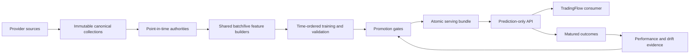

# Catalyst-Confirmation Prediction Architecture

Status: design authority
Last updated: 2026-08-13

This document defines stable component boundaries. Current progress and blockers are
in `active_edge_rebuild_plan.md` and `reviews/active_edge_rebuild_handoff.md`.

## System Boundary

`market-predictor` owns data curation, causal features, labels, model research,
validation, promotion, prediction, and outcome evaluation. It does not own alerts,
orders, execution, positions, portfolio risk, or notification delivery.

There is no fallback from the active path to legacy models or schemas.

## Prediction Views

### Swing

- Strategy identity: `swing`; hypothesis: Sector Residual Momentum.
- Decision clock: completed daily session.
- Entry: next exact exchange-session open.
- Horizon: ten exchange sessions with target/stop/timeout outcomes.
- Model families are explicit. `swing_baseline` consumes only `technical_market` and
  uses catalyst as confirmation/explanation. `swing_event_driven` may consume only a
  separately promoted event-specialist contract. The current A3 contract admits only
  direct-issuer broker rating actions (internally coded `analyst_revision`); it does
  not reuse a broad catalyst profile. No family is serveable until it passes promotion.
- Issuer filing catalyst: SEC events aligned by acceptance time and resolved to the
  filing issuer; they enter an estimator only after causal authority and ablation pass.
- Context overlays: verified global and sector events through separate authorities.
  Finviz supplies screening/current metadata, not news features.
- Required comparisons: SPY, QQQ, and point-in-time sector ETF over the same interval.

### Intraday

- Strategy identity: `intraday`; hypothesis: VWAP Exhaustion Reversal.
- Decision clock: fixed exchange-calendar five-minute cohort after activation. The
  feature state uses the latest completed causal volume bar available by that cutoff;
  asynchronous volume-bar completion never defines the cross-sectional cohort.
- Entry: next exact observed one-minute open.
- Horizon: thirty regular-session minutes with target/stop/timeout outcomes.
- Estimator inputs: exact technical, market, QQQ, and point-in-time sector features.
- Ticker catalyst: confirmation, contradiction, explanation, and ranking overlay.
- Global and sector context: separate explanation and ranking overlays. Neither overlay
  enters the current intraday estimator vector.

## Data Layers

### Market data

- Alpaca SIP and `adjustment=all` are mandatory for model evidence.
- Point-in-time membership and ticker identity include changes and delistings.
- Swing uses daily bars with at least 250 valid sessions of warm-up.
- Intraday uses five-minute discovery/technical history and selective exact one-minute
  execution paths.
- Intraday has two non-interchangeable model profiles. The bar-only profile uses
  verified SIP/all one- and five-minute bars plus benchmark/membership authorities.
  The microstructure-enhanced profile additionally requires a complete immutable SIP
  trade/quote authority and one-minute materialization. Partial raw transport cannot
  silently alter the bar-only profile.
- The completed bar-only authority binds every session unit to the exact feature/label
  transformation hashes, replays source hashes at read time and before final publish,
  and preserves missing five-minute observations as row-level abstentions.
- SPY, QQQ, and the point-in-time sector ETF use the identical decision and outcome
  interval as the stock.

### Ticker catalyst

Each event records provider publication/update time, first-observed or explicit
historical-proxy policy, sentiment scoring time, final feature availability, direct
issuer/business attribution, source coverage, and immutable lineage.

Ticker catalyst sources are direct-issuer Alpaca news and SEC issuer filing events.
Historical estimator input remains exactly Alpaca until the SEC authority passes
coverage, immutable replay, and frozen ablation. Missing required source coverage is
unavailable, not zero, and no additional source may silently alter the trained vector.

Reddit and Seeking Alpha are retired and prohibited from collection, feature
construction, training, serving, and runtime integration.

### Global events

Global events use `MARKET` identity and a separate authority. Flashpoint families,
including shipping/energy, Taiwan/semiconductors, Russia/Black Sea, critical minerals,
and cyber/infrastructure, remain distinguishable. They are never copied to a stock as
ticker-specific news.

Sector context follows the same separation: it may influence market or sector overlays,
but topic similarity alone cannot create issuer catalyst attribution.

Retrospective collection may support research when its proxy policy is explicit.
Production context requires observed source coverage completed before the prediction
decision.

## Authority Contract

Every authority is immutable and contains:

- request and source-policy hashes;
- provider/feed/adjustment identity where applicable;
- collection windows, completion, status, and row counts;
- source artifact and child-manifest hashes;
- feature/label availability policy;
- model/revision identity for learned preprocessing such as FinBERT;
- production-ready or research-only classification;
- memory and audit evidence.

Event and coverage artifacts must reconcile by request, source, window, status, and row
count. Unknown coverage is null. A known zero requires complete verified coverage.

## Feature Construction

Historical and live decisions call the same semantic builders. A live path may select
the latest eligible decision but may not substitute stale or previous benchmark rows.
The exact ordered estimator schema is hash-bound in the promoted bundle.

Required tests include:

- future-poison invariance;
- missing-source unknown versus observed zero;
- sparse-session abstention;
- exact batch/live numerical parity;
- stale-decision rejection;
- row/label identity across ablations;
- identical decision IDs, folds, costs, labels, and benchmark intervals for bar-only
  versus microstructure matched ablation;
- artifact, path-traversal, and hash tampering.

## Training And Evaluation

Splits are chronological, purged, and embargoed. Security holdouts are separate from
temporal validation. The locked test is opened once after model and threshold selection.
Prospective shadow outcomes are not used for retraining until their evaluation closes.

Model selection considers calibration and ranking quality but promotion requires
cost-adjusted return, SPY/QQQ/sector excess, drawdown, turnover, capacity, and regime
stability. ROC AUC alone cannot promote a trading model.

The current swing V12 base authority contains 853,417 technical rows across 604
securities and 1,759 sessions. Corrected A3.4 separately contains 27,087 matched
prediction rows from 11,720 unique latest broker announcements in each of three
datasets: technical-only, broker-action-only, and combined. Exact ticker and exact
prediction timestamp map the older event authority to the rebuilt technical panel;
conflicting CIKs fail closed. A3.5 separately evaluated rating changes and coverage
initiation across technical-only, broker-action-only, and combined profiles. All 12
development experiments failed the inner selection gates, so outer validation and the
locked test remained unopened. No specialist is serveable.
Prior swing candidates and Intraday V2 are rejection evidence only. There is currently
no promoted model for either view.

A2 replaces the broad profile comparison with a six-candidate technical baseline:
four nested regularized-logistic feature ablations plus full-feature XGBoost ranking
and regression candidates. Fitted estimators carry their exact ordered feature subset.
The signed serving bundle binds `model_family`, `feature_profile`, and catalyst policy;
the prediction service selects the corresponding live frame without fallback. No new
real A2 candidate or performance result exists yet.

## Serving

One atomic bundle binds:

- model artifact and SHA256;
- preprocessing and exact ordered feature schema;
- strategy, source, catalyst, global, label, and cost policies;
- promotion evidence and SHA256;
- dependency identity and promotion timestamp.

Serving reloads and verifies the bundle and all referenced files, builds causal live
features, compares batch/live schemas, and either returns a prediction or an explicit
abstention. No unpromoted model may score.

The response contains mode, ticker, as-of time, horizon, direction/probability,
technical score, ticker-catalyst availability, separate global/sector-context
availability, SPY/QQQ/sector comparisons, model/bundle identity, and abstention reasons.
It contains no order instruction.

## Outcome Loop

Every scored prediction registers an immutable outcome intent. After the exact horizon
closes, the same label evaluator matures realized stock and benchmark outcomes. Reports
measure calibration, net return, excess return, drawdown, coverage, missingness, drift,
and regime/cohort stability against the exact serving bundle and policy hashes.

Monitoring may recommend retirement or retraining. It may not silently replace the
active model, alter thresholds, or execute trades.

## Resource And Deployment

- One heavy data or training process at a time.
- Swing candidate training has a 5 GiB hard process limit. Intraday and serving
  workloads retain 4 GiB limits.
- GPU is optional acceleration; CPU behavior remains deterministic and testable.
- Cloud deployment uses the same immutable artifacts and contracts. Infrastructure is
  not evidence that a model is ready.
- Secrets stay in environment variables or managed secret stores and never enter
  artifacts, logs, tests, or source.
