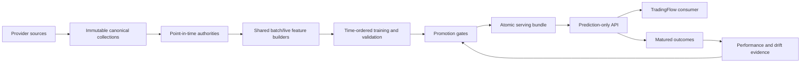

# Catalyst-Confirmation Prediction Architecture

Status: design authority
Last updated: 2026-09-07

This document defines stable component boundaries. Current progress and blockers are
in `active_edge_rebuild_plan.md` and `reviews/active_edge_rebuild_handoff.md`.

## System Boundary

`market-predictor` owns data curation, causal features, labels, model research,
validation, promotion, prediction, and outcome evaluation. It does not own alerts,
orders, execution, positions, portfolio risk, or notification delivery.

There is no fallback from the active path to legacy models or schemas.

## Prediction Views

### Swing

- New long-only research is governed by `configs/swing_research.toml`, separately
  hashed from immutable historical strategy/feature contracts. It targets fixed
  ten-session net SPY excess; managed-exit outcomes are a separate evaluation.
  Its two regressors and three feature profiles are planned, not trained models.
- `swing/contracts/research.py` rejects the known exposed July 2025-June 2026
  final-test interval before the retained trainer loads data. Metadata inventory
  verification does not replay source rows or establish total-return correctness.
- Strategy identity: `swing`; hypothesis: Sector Residual Momentum.
- Decision clock: completed daily session.
- Entry: next exact exchange-session open.
- Horizon: ten exchange sessions with target/stop/timeout outcomes.
- Model families are explicit. `swing_baseline` consumes only `technical_market` and
  uses catalyst as confirmation/explanation. `swing_event_driven` may consume only a
  separately promoted event-specialist contract. The current A3 contract admits only
  direct-issuer broker rating actions (internally coded `analyst_revision`); it does
  not reuse a broad catalyst profile. No family is serveable until it passes promotion.
- Issuer filing catalyst: SEC events aligned by acceptance time and resolved to the
  filing issuer; they enter an estimator only after causal authority and ablation pass.
- Context overlays: verified global and sector events through separate authorities.
  Finviz supplies screening/current metadata, not news features.
- Fixed-horizon comparisons require SPY, QQQ, and point-in-time sector ETF over
  the same interval. A daily benchmark close is only approximate at an intraday
  stock barrier exit. The new economic objective is complete daily NAV versus SPY;
  QQQ/sector and approximate trade-level comparisons remain diagnostics.

### Offline Swing Accounting

`swing/labels/holding_paths.py` owns exact XNYS holding calendars and daily
observation validation. Fixed labels take a separate security-identified outcome
source; membership controls entry eligibility, not the lifetime of an existing
holding. The same source supplies barrier outcomes and managed daily marks.
Calendar gaps remain unknown observations, never next-available-bar entries.
Exact opens/closes include DST and early-close sessions. Live maturation shares
observation validation and does not accept zero-volume price placeholders.
Passing identity shape checks is not provider identity proof. Post-removal source
mapping and new immutable/replayed outcome authorities are required before training;
old membership-truncated authorities are retained historical evidence, not patched.
The materialization request binds the named independent-holding panel schema and
holding-path implementation hashes. Resume and completed-authority loading reject
old or changed implementations before reusing their partitions.

`swing/contracts/research_cohort.py` defines whole-security research restrictions.
`research/swing_cohort.py` verifies pinned parent inputs and projects only security,
session and sector columns to audit coverage. Cumulative exclusions use the original
modeled population, including inherited coverage failures but excluding warm-up-only
IDs. `commands/swing_research.py` exposes the bounded, serialized audit command.
The materializer applies an accepted cohort to memberships before stock batches and
cross-sectional transforms. The request binds the complete restriction and its hash;
the manifest exposes its hash and retrospective scope. Resume and final loading
reject a changed cohort. The retained classification/ranking training interface
explicitly refuses this population; the development-only return-training consumer
must be implemented before the new six-fit campaign. Benchmarks remain required.
This is a disclosed retrospective development choice, not point-in-time selection,
bar repair, total-return certification or a promotion decision. Original raw files
and the original failed control remain unchanged.

`swing/labels/holding_identity.py` inspects exact ten-session ownership windows
using the shared XNYS holding calendar. Decision-time identity/sector joins remain
causal. Future membership intervals are used only as retrospective ownership
evidence, never as features. Continuous same-owner intervals are merged despite
metadata changes; competing owners, including excluded securities, remain visible.
`research/swing_holding_identity_preflight.py` runs bounded monthly identity-only
projections under the shared heavy-job lease and publishes an immutable report
bound to the approved cohort and all input hashes. It separates initial-fit and
full-history coverage, without reading numeric features or returns. This report
cannot admit bar coverage, total-return accounting, model training or promotion.

`swing/datasets/holding_observation_requirements.py` reproduces the frozen initial-fit
flagged decisions from identity-only parent projections before any numeric read.
`holding_observations.py` projects raw SIP/all daily bars through an exact required-date
Arrow predicate and the shared outcome-clock/price validator. It uses the shared
membership coverage implementation, retaining excluded competing owners. Requested
identity is metadata; unresolved observations have null observed `security_id`.
`holding_observation_inventory.py` runs the bounded, serialized diagnostic and publishes
decisions, observations and a source/implementation/output-hash-bound manifest atomically.
Missing observations, invalid OHLCV, malformed sources and unresolved ownership remain
independent facts. This partial repair inventory must not replace a complete shard's
`outcome_bars`; it is not an admitted holding authority or a training dataset.

`sources/alpaca_corporate_actions.py` owns the exact single-ticker query and strict
one-page raw response decoder. It preserves unknown families and incomplete action
records for later interpretation. `swing/datasets/corporate_action_collection.py`
binds the initial-fit observation inventory, then archives bounded provider pages
and immutable per-ticker attempt receipts under the shared workspace lease.
Successful tickers are not requested again; failures remain independent. Offline
replay reconstructs counts from raw pages and checks an independently retained report
hash. Provider process dates, action-effective/ex/payable dates and retrieval clocks
remain distinct. No historical announcement availability, universal action coverage,
stock ownership or settlement accounting is inferred from successful collection.

`sources/official_documents.py` acquires the exact official URLs configured in
`configs/swing_holding_source_documents.toml`. It uses the existing bounded HTTP
transport and SEC governor, rejects automatic redirects, and atomically publishes
each response body and immutable attempt receipt. Encoded bytes, retrieval clock,
URL, headers and hash remain distinct from publication or acceptance time. One
failed source does not erase other documents; a forbidden/rate-limited host is
deferred for the remainder of the run. Successful requests resume after offline
verification. Content-addressed reports bind the receipt inventory.

The command adapter lives in `commands/swing_collection.py`, exposed only on the
collection CLI. Source collection does not import swing evaluators or decide
identity continuity, entitlement, cash availability, total returns or readiness.
`archived_unreviewed` means bytes acquired, not document content approved. The
initial archive is incomplete; interpretation and expanded outcome admission
remain separate required work. No compatibility path or alternate ledger is added.

`research/swing_transfer_sources.py` binds selected initial-fit decision identities,
canonical membership/issuer anchors and retained daily bars to exact XNYS holding
sessions. `research/swing_transfer_replay.py` acquires only those short SIP windows,
with an explicit historical `asof`, exact raw pages, bounded pagination and immutable
attempt/report hashes. It uses the same response decoder as `sources/alpaca.py`.
The root-scoped heavy-job lease precedes input loading; collection is sequential.
Offline replay needs no credentials. Successful acquisitions are not fetched again.
Failures are isolated per ticker; memory or publication failures stop the job.
Price comparisons are diagnostics, not identity or accounting admission.

`universe/security_class_evidence.py` extracts explicit SEC iXBRL facts from pinned
filing bytes. Symbol/title/exchange must share one table row and context; issuer
association preserves legal-entity dimensions. Ambiguous classes or registrants
fail closed. These facts and S&P transfer evidence still require a separately
reviewed, session-bounded retrospective identity binding. Neither a matching CIK
nor a successful Alpaca `asof` lookup alone authorizes that binding.

`swing/evaluation/ledger.py` owns the single funded ledger. Each cohort
requests one tenth of prior-close NAV, equal-weight across its selected securities.
Cash caps the cohort pro rata including prepaid round-trip costs. Entries precede
exits; exit proceeds become available next session. Separate exit lots aggregate
security/sector exposure. Daily cash, holdings and realized/unrealized P&L reconcile
to NAV, including idle sessions and the fixed maturation tail.

`swing/evaluation/accounting.py` compares this ledger with SPY on exactly that
calendar, at base and stressed costs. QQQ and point-in-time sector curves remain
required diagnostics. Familywise-adjusted 20/40-session block intervals evaluate
daily portfolio-minus-SPY returns, not independent stock rows. Full-account returns
are distinct from fixed-horizon stock labels and approximate barrier-exit comparisons.

`modeling/resampling.py` owns the shared, horizon-neutral moving-block calculation.
`research/swing_accounting_control.py` verifies pinned metadata and selected partitions,
selects a deterministic momentum control before loading its outcomes, and publishes
an immutable report. The entire decision/outcome window stays inside initial fit.
No estimator is fitted and the report is not out-of-sample performance.

Current output is `price_ratio_diagnostics`, with `price_basis_pending` and economic
eligibility false. Adjusted-price declarations or caller-authored flags cannot prove
total-return/distribution reconciliation. No raw-share execution, dividend credit,
deployment approval or dollar-capacity claim is inferred from this offline account.

### Intraday

- Strategy identity: `intraday`; hypothesis: VWAP Exhaustion Reversal.
- Decision clock: fixed exchange-calendar five-minute cohort after activation. The
  feature state uses the latest completed causal volume bar available by that cutoff;
  asynchronous volume-bar completion never defines the cross-sectional cohort.
- Entry: next exact observed one-minute open.
- Horizon: thirty regular-session minutes with target/stop/timeout outcomes.
- Estimator inputs: exact technical, market, QQQ, and point-in-time sector features.
- Ticker catalyst: confirmation, contradiction, explanation, and ranking overlay.
- Global and sector context: separate explanation and ranking overlays. Neither overlay
  enters the current intraday estimator vector.

## Data Layers

### Market data

- Alpaca SIP and `adjustment=all` are mandatory for model evidence.
- Point-in-time membership and ticker identity include changes and delistings.
- Swing uses daily bars with at least 250 valid sessions of warm-up.
- Intraday uses five-minute discovery/technical history and selective exact one-minute
  execution paths.
- Intraday has two non-interchangeable model profiles. The bar-only profile uses
  verified SIP/all one- and five-minute bars plus benchmark/membership authorities.
  The microstructure-enhanced profile additionally requires a complete immutable SIP
  trade/quote authority and one-minute materialization. Partial raw transport cannot
  silently alter the bar-only profile.
- The completed bar-only authority binds every session unit to the exact feature/label
  transformation hashes, replays source hashes at read time and before final publish,
  and preserves missing five-minute observations as row-level abstentions.
- Audit v2 independently binds the supplied five-minute projection path and hashes,
  verifies the maximum raw source timestamp and five-minute prefix completeness, and
  fails on any eligible row using late or incomplete evidence. Dataset execution
  telemetry is a separate authority because it cannot change feature or label identity;
  future resumable publications require hash-bound per-invocation memory receipts.
- SPY, QQQ, and the point-in-time sector ETF use the identical decision and outcome
  interval as the stock.

### Ticker catalyst

Each event records provider publication/update time, first-observed or explicit
historical-proxy policy, sentiment scoring time, final feature availability, direct
issuer/business attribution, source coverage, and immutable lineage.

Ticker catalyst sources are direct-issuer Alpaca news and SEC issuer filing events.
Historical estimator input remains exactly Alpaca until the SEC authority passes
coverage, immutable replay, and frozen ablation. Missing required source coverage is
unavailable, not zero, and no additional source may silently alter the trained vector.

Reddit and Seeking Alpha are retired and prohibited from collection, feature
construction, training, serving, and runtime integration.

### Global events

Global events use `MARKET` identity and a separate authority. Flashpoint families,
including shipping/energy, Taiwan/semiconductors, Russia/Black Sea, critical minerals,
and cyber/infrastructure, remain distinguishable. They are never copied to a stock as
ticker-specific news.

Sector context follows the same separation: it may influence market or sector overlays,
but topic similarity alone cannot create issuer catalyst attribution.

Retrospective collection may support research when its proxy policy is explicit.
Production context requires observed source coverage completed before the prediction
decision.

## Authority Contract

Every authority is immutable and contains:

- request and source-policy hashes;
- provider/feed/adjustment identity where applicable;
- collection windows, completion, status, and row counts;
- source artifact and child-manifest hashes;
- feature/label availability policy;
- model/revision identity for learned preprocessing such as FinBERT;
- production-ready or research-only classification;
- memory and audit evidence.

Event and coverage artifacts must reconcile by request, source, window, status, and row
count. Unknown coverage is null. A known zero requires complete verified coverage.

## Feature Construction

Historical and live decisions call the same semantic builders. A live path may select
the latest eligible decision but may not substitute stale or previous benchmark rows.
The exact ordered estimator schema is hash-bound in the promoted bundle.

Required tests include:

- future-poison invariance;
- missing-source unknown versus observed zero;
- sparse-session abstention;
- exact batch/live numerical parity;
- stale-decision rejection;
- row/label identity across ablations;
- identical decision IDs, folds, costs, labels, and benchmark intervals for bar-only
  versus microstructure matched ablation;
- artifact, path-traversal, and hash tampering.

## Training And Evaluation

Splits are chronological, purged, and embargoed. Security holdouts are separate from
temporal validation. The locked test is opened once after model and threshold selection.
Prospective shadow outcomes are not used for retraining until their evaluation closes.

Model selection considers calibration and ranking quality but promotion requires
cost-adjusted return, SPY/QQQ/sector excess, drawdown, turnover, capacity, and regime
stability. ROC AUC alone cannot promote a trading model.

The current swing V12 base authority contains 853,417 technical rows across 604
securities and 1,759 sessions. Corrected A3.4 separately contains 27,087 matched
prediction rows from 11,720 unique latest broker announcements in each of three
datasets: technical-only, broker-action-only, and combined. Exact ticker and exact
prediction timestamp map the older event authority to the rebuilt technical panel;
conflicting CIKs fail closed. A3.5 separately evaluated rating changes and coverage
initiation across technical-only, broker-action-only, and combined profiles. All 12
development experiments failed the inner selection gates, so outer validation and the
locked test remained unopened. No specialist is serveable.
Prior swing candidates, Intraday V2, and both A4.4 bar-only hypotheses are rejection
evidence only. A4.4 used paired expected-net-return and calibrated stop-risk estimators,
stable unseen-security holdout, four purged chronological folds, exact portfolio costs,
and SPY/QQQ/sector comparisons. Continuation and long reversion both produced
`no_candidate`; the future holdout was not opened. There is currently no promoted model
for either view.

A2 replaces the broad profile comparison with a six-candidate technical baseline:
four nested regularized-logistic feature ablations plus full-feature XGBoost ranking
and regression candidates. Fitted estimators carry their exact ordered feature subset.
The signed serving bundle binds `model_family`, `feature_profile`, and catalyst policy;
the prediction service selects the corresponding live frame without fallback. No new
real A2 candidate or performance result exists yet.

## Serving

One atomic bundle binds:

- model artifact and SHA256;
- preprocessing and exact ordered feature schema;
- strategy, source, catalyst, global, label, and cost policies;
- promotion evidence and SHA256;
- dependency identity and promotion timestamp.

Serving reloads and verifies the bundle and all referenced files, builds causal live
features, compares batch/live schemas, and either returns a prediction or an explicit
abstention. No unpromoted model may score.

The response contains mode, ticker, as-of time, horizon, direction/probability,
technical score, ticker-catalyst availability, separate global/sector-context
availability, SPY/QQQ/sector comparisons, model/bundle identity, and abstention reasons.
It contains no order instruction.

## Outcome Loop

Every scored prediction registers an immutable outcome intent. After the exact horizon
closes, the same label evaluator matures realized stock and benchmark outcomes. Reports
measure calibration, net return, excess return, drawdown, coverage, missingness, drift,
and regime/cohort stability against the exact serving bundle and policy hashes.

Monitoring may recommend retirement or retraining. It may not silently replace the
active model, alter thresholds, or execute trades.

## Resource And Deployment

- One heavy data or training process at a time.
- Swing candidate training has a 5 GiB hard process limit. Intraday and serving
  workloads retain 4 GiB limits.
- GPU is optional acceleration; CPU behavior remains deterministic and testable.
- Cloud deployment uses the same immutable artifacts and contracts. Infrastructure is
  not evidence that a model is ready.
- Secrets stay in environment variables or managed secret stores and never enter
  artifacts, logs, tests, or source.
