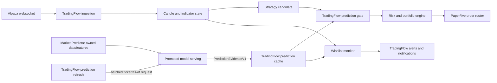

# TradingFlow Integration Plan

## 1. Objective

Integrate `market-predictor` with the C# `trading_flow` runtime so promoted ML predictions can be used as auditable strategy context in backtest, paper, and eventually automated live trading.

The integration must preserve one decision and execution owner:

- `market-predictor` produces versioned prediction evidence.
- `trading_flow` decides whether a setup is actionable, emits alerts, applies portfolio/risk rules, and owns broker execution.

A prediction is not an alert, trade signal, order instruction, stop, target, or position size.

## 2. Non-Negotiable Ownership Boundary

| Capability | Owner | Notes |
| --- | --- | --- |
| Model training, feature engineering, validation, promotion | `market-predictor` | Includes model manifests and prediction snapshots. |
| Specialized ML catalyst context | `market-predictor` | Seeking Alpha, SEC, Reddit, Finviz, Alpaca news, and global context used for ML. |
| Prediction API and model readiness | `market-predictor` | Returns evidence only from explicitly selected/promoted routes. |
| Alpaca production websocket | `trading_flow` | Exactly one active account connection, fanned out internally. |
| Live candle and indicator state | `trading_flow` | Source of truth for strategy and execution timing. |
| Strategy/confluence decision | `trading_flow` | ML is one configured input to the shared decision brain. |
| Alerts and notifications | `trading_flow` | Wishlist observer, signal persistence, dedupe, acknowledgement, web/mobile delivery. |
| Risk, portfolio, orders, positions, P/L | `trading_flow` | Never delegated to the predictor. |
| Backtesting and paper/live parity | `trading_flow` | Uses recorded point-in-time prediction evidence. |

There is no shared database and no shared OHLCV repository. Each project retains its own storage. Only versioned API messages and, later, completed-bar events cross the boundary.

## 3. Alert Removal From market-predictor

Runtime alerting is out of scope for `market-predictor`. The repository currently contains legacy alert code and commands from an earlier design. They must be retired in a controlled migration:

1. Mark `monitor-alerts` and `backtest-alerts` deprecated and prevent their use in deployment schedules.
2. Verify equivalent technical rules are represented by `trading_flow`'s `WishlistBreakoutEvaluator`, `WishlistMarketMonitor`, and strategy tests.
3. Move any still-useful rule tests or research findings to `trading_flow`.
4. Remove `alerts.py`, its CLI imports/commands, and `data/live/alerts` output ownership from `market-predictor`.
5. Rename prediction-only "monitor" reports, such as sector/theme ranking, so they cannot be confused with notifications.

After migration, `market-predictor` may return fields named `signal` as model classifications, but it must not persist alerts, deduplicate notifications, acknowledge alerts, send webhooks/push messages, or trigger automation.

## 4. Current Integration Readiness

As of 2026-07-10:

- The 5-day S&P 500 swing route has a promoted manifest, but it was promoted under the earlier gate set. Use it for display/shadow integration until it passes the current profitability, drawdown, regime, and catalyst audits.
- The 1-day swing route is a candidate.
- The API-default intraday model is a candidate and fails current AUC/lift gates.
- The opening-session V2 intraday models failed predictive and trading-economics gates.

Therefore the first integration is read-only 5-day swing context. Automated ML gating and intraday ML integration are not enabled in the first release.

## 5. Target Architecture



The order path reads a local TradingFlow cache. It does not wait on a Python HTTP request. Prediction refresh is asynchronous and batched.

## 6. Integration Contract

Use the existing HTTP endpoints as the first transport:

- `GET /v1/health`
- `POST /v1/predictions/swing`
- `POST /v1/predictions/intraday`
- `POST /v1/predictions/unified`
- `POST /v1/replays/investment` remains a research endpoint, not an execution endpoint.

Add a contract version independent of the application version. TradingFlow should deserialize only a stable evidence DTO, not Python-internal feature rows.

### Request

Required integration fields:

| Field | Rule |
| --- | --- |
| `tickers` | Batched, normalized symbols from the TradingFlow universe. |
| `mode` | Explicit `swing`, `intraday`, or `unified`. Do not infer from strategy names. |
| `horizon` | Explicit and compatible with the configured strategy. |
| `as_of` | Timezone-aware decision cutoff. No prediction may use information after this timestamp. |
| `data_source` | `live` for operational use, `curated` for controlled research. |
| `require_promoted` | Always `true` for paper/live. Candidate use is an explicit backtest/research override. |
| `correlation_id` | Planned addition supplied by TradingFlow and retained end to end. |

### PredictionEvidenceV1

TradingFlow should map the response into a domain record containing:

```text
contract_version
request_id
correlation_id
snapshot_id
generated_at_utc
ticker
model_view
resolved_horizon
prediction_as_of_utc
prediction_label
probability
decision_score
readiness_status
readiness_reasons
catalyst_status
catalyst_score
model_status
model_target
model_schema_version
model_artifact_sha256
model_training_data_end
source_errors
```

Required validation in TradingFlow:

- Contract version is supported.
- Ticker, view, and horizon match the strategy request.
- `generated_at_utc` and feature timestamps are not in the future relative to the decision.
- Evidence is inside the strategy's configured maximum age.
- Readiness is `valid` unless the strategy explicitly permits `warn` in research.
- Model status is `promoted` for paper/live.
- Artifact SHA-256 matches the strategy/run pin when a pin is configured.
- A partial unified response is never interpreted as a complete response.

Do not map this DTO to TradingFlow's existing `ExternalSignal`. That record contains action, side, stop, target, and price semantics. ML evidence belongs in a separate `PredictionEvidence` type and is evaluated by the strategy brain before any `TradeSignal` exists.

## 7. TradingFlow Components

Add components in the existing C# layering:

| Layer | Planned component | Responsibility |
| --- | --- | --- |
| Domain | `PredictionEvidence`, `PredictionReadiness`, `PredictionModelIdentity` | Transport-independent evidence types. |
| Engine | `IPredictionProvider`, `PredictionConfirmationGate` | Validate freshness/status and apply configured strategy policy. |
| Infrastructure adapter | `MarketPredictorHttpClient` | Typed HTTP client, authentication, retries, timeout, circuit breaker, contract mapping. |
| Data | `IPredictionEvidenceRepository` plus SQLite implementation | Persist evidence used by each decision and support deterministic replay. |
| Web/worker | `PredictionRefreshService` | Batch-refresh active wishlist/strategy universes outside the order path. |
| Audit/UI | Prediction evidence panel | Show probability, horizon, readiness, model SHA, catalyst state, and rejection reason. |

`WishlistObserverService` and `WishlistMarketMonitor` remain the only alert path. They may read cached prediction evidence to enrich an alert, but the alert is created, deduplicated, stored, acknowledged, and delivered by TradingFlow.

## 8. Strategy Configuration

Add an explicit configuration block; do not hide ML policy in generic confluence settings:

```yaml
prediction_confirmation:
  enabled: true
  provider: market_predictor
  view: swing
  horizon: 5d
  policy: observe          # observe | optional | required
  require_promoted: true
  allowed_readiness: valid
  max_age_minutes: <strategy-specific>
  minimum_probability: <backtested-value>
  minimum_decision_score: <optional-backtested-value>
  on_unavailable: continue_without_ml  # or reject_entry
  pinned_model_sha256: <optional>
```

Rules:

- `observe` records evidence but cannot change decisions.
- `optional` may rank or strengthen a decision but cannot rescue a failed technical/risk gate.
- `required` rejects entry when valid promoted evidence is unavailable or below a predeclared threshold.
- `minimum_probability` is model/horizon specific and must be selected through TradingFlow backtests, not copied between models.
- Automated live strategies must pin the accepted model identity or use a separately audited controlled-rollout policy.

## 9. Decision Sequence

1. TradingFlow receives a completed bar from its single ingestion path.
2. Indicator and strategy logic identifies a candidate setup.
3. The decision brain reads point-in-time prediction evidence from its local cache.
4. The prediction gate validates contract, model status, horizon, timestamp, freshness, and readiness.
5. Strategy policy applies the evidence as `observe`, `optional`, or `required`.
6. TradingFlow records the entire evidence identity and gate result in the decision audit.
7. Existing risk, portfolio, ticker lock, and broker idempotency rules run unchanged.
8. TradingFlow may emit a wishlist alert or submit an order according to its own independently promoted strategy configuration.

No predictor response bypasses steps 4-7.

## 10. Backtest And Replay

Historical backtests must not call the current live prediction endpoint for each old bar. They consume immutable point-in-time prediction snapshots keyed by:

```text
ticker + model_view + horizon + prediction_as_of_utc + model_artifact_sha256
```

The snapshot must include the original request/response hash and feature/model watermarks. TradingFlow joins only evidence whose availability timestamp is less than or equal to the simulated decision time. Missing evidence follows the strategy's declared `on_unavailable` policy.

Promotion evaluation remains split:

- `market-predictor` proves model discrimination, data quality, and model-level economics.
- `trading_flow` proves strategy-level return, drawdown, turnover, capacity, slippage, and portfolio interaction with and without the ML gate.

Every ML-enabled strategy backtest needs an ablation:

1. Strategy without ML evidence.
2. Strategy with ML in `observe` mode.
3. Strategy with the proposed optional/required gate.

## 11. Live Intraday Data Handoff

Do not build this until an intraday model is promoted.

When required, TradingFlow publishes normalized **completed** bar events from its existing single stream to a private internal transport. `market-predictor` consumes those events to update its live feature store. This is a minimal event contract, not shared storage.

`CompletedBarV1` requires:

```text
event_id
ticker
timeframe
bar_start_utc
bar_end_utc
open
high
low
close
volume
feed
adjustment
received_at_utc
```

Requirements:

- At-least-once delivery with idempotency by `event_id` and ticker/timeframe/bar end.
- Ordered processing within ticker/timeframe.
- Explicit SIP/feed provenance.
- Gap and duplicate detection.
- Backfill-to-stream continuity audit.
- Market Predictor opens no second production Alpaca websocket.

## 12. Failure Policy

| Condition | `observe` | `optional` | `required` |
| --- | --- | --- | --- |
| Predictor unavailable | Record unavailable | Continue without ML and record | Reject entry |
| Stale evidence | Record stale | Continue without ML and record | Reject entry |
| Candidate/unpromoted model | Record invalid | Ignore ML | Reject entry |
| Readiness `invalid` | Record invalid | Ignore ML | Reject entry |
| Partial unified response | Use only explicit available view | Use only configured available view | Reject if required view missing |
| Contract/schema mismatch | Reject evidence | Reject evidence | Reject entry |

Retries occur in the asynchronous refresh service. The order path is cache-only and does not retry remote inference.

## 13. Security And Operations

- Keep the predictor API private to the deployment network.
- Use managed identity/service authentication in Azure; use a scoped local token for development.
- Store secrets in Key Vault or local secret stores, never in strategy YAML or prediction snapshots.
- Propagate correlation ID through TradingFlow decision audit, predictor request, predictor snapshot, and order audit.
- Record request count, latency, cache age, stale/missing rate, contract failures, model status, readiness status, and gate outcome.
- Deploy the services independently. A predictor outage must not corrupt TradingFlow market state or broker state.

## 14. Phased Delivery

### Phase 0: Ownership Cleanup

- Freeze Market Predictor alert development.
- Deprecate its alert CLI schedules and document TradingFlow as alert owner.
- Inventory/migrate useful alert rules, then remove predictor alert runtime code.
- Add architecture tests or static checks preventing predictor-to-broker and predictor-to-notification dependencies.

Exit gate: only TradingFlow creates persisted/user-visible alerts.

### Phase 1: Contract And Shadow Display

- Add `PredictionEvidence` C# contracts and typed client.
- Add correlation ID and capability/readiness API contracts.
- Integrate only the 5D promoted swing route.
- Batch refresh and display evidence in TradingFlow audit/UI.
- Do not change strategy decisions.

Exit gate: contract tests pass and evidence is point-in-time, persisted, and explainable.

### Phase 2: Deterministic Backtest Integration

- Export/store immutable point-in-time prediction snapshots.
- Add TradingFlow replay provider.
- Run no-ML versus observe versus gated ablations.
- Measure costs, turnover, drawdown, and regime stability.

Exit gate: no leakage, repeatable results, and a predeclared gate beats the no-ML baseline after costs.

### Phase 3: Paper Trading Gate

- Re-audit the 5D model under current model gates.
- Enable `optional` or `required` only for an independently promoted TradingFlow strategy.
- Keep broker live mode disabled.
- Compare predicted, accepted, rejected, and realized outcomes.

Exit gate: paper behavior, failure handling, alert behavior, and audit evidence meet the agreed observation window.

### Phase 4: Controlled Automated Trading

- Pin strategy version and model SHA.
- Start with narrow universe and portfolio limits.
- Enable kill switch, circuit breakers, and rollback to strategy-without-ML or no-new-entries.
- Require human approval for strategy/model rollout changes.

Exit gate: explicit operational approval after paper and shadow evidence.

### Phase 5: Intraday ML

- Promote an intraday model on fresh shadow data first.
- Add completed-bar event handoff from TradingFlow.
- Validate feature parity and bar timing.
- Repeat Phases 1-4 for the intraday view; do not inherit swing thresholds.

## 15. Acceptance Checklist

- [ ] No alerts, notifications, broker calls, or position state in `market-predictor`.
- [ ] Exactly one production Alpaca websocket, owned by TradingFlow.
- [ ] No shared database or shared OHLCV storage.
- [ ] Stable versioned prediction and completed-bar contracts.
- [ ] `require_promoted=true` enforced in paper/live.
- [ ] Order path reads local cached evidence only.
- [ ] Every decision stores model SHA, prediction timestamp, readiness, and request/snapshot IDs.
- [ ] Historical replay is point-in-time and deterministic.
- [ ] Strategy ablation proves incremental value after costs.
- [ ] TradingFlow owns alert dedupe, persistence, acknowledgement, and delivery.
- [ ] Intraday integration remains off until an intraday model is promoted.
